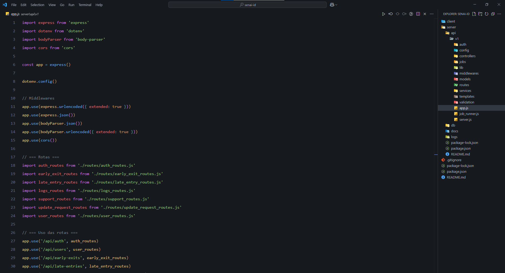

# Configurações Personalizadas do Visual Studio Code

Este repositório contém um conjunto de configurações personalizadas para o Visual Studio Code (VSCode), com o objetivo de criar um ambiente de desenvolvimento otimizado para a produtividade e conforto visual.

## Configurações

As configurações do `settings.json` foram ajustadas para melhorar a estética e a funcionalidade do editor. Algumas das principais características incluem:

- **Tema Escuro**: `One Dark Pro Night Flat`
- **Fonte**: `Dank Mono` com ligaduras de fonte ativadas
- **Minimap e Breadcrumbs**: Desativados para uma experiência de edição mais limpa
- **Barra de Status e Barra de Atividades**: Ocultas para reduzir distrações
- **Exibição de Árvores**: Indentação ajustada, com guias de indentação ocultas
- **Controle de Layout**: Navegação e controle de layout desativados para maior simplicidade

As configurações estão detalhadas no arquivo `settings.json`.

## Personalizações

- **Fonte**: `Dank Mono` foi escolhida para uma leitura confortável com suporte a ligaduras.
- **Tema de Ícones**: Usamos o tema `symbols` para um visual mais minimalista.
- **Comportamento de Barra de Status**: A barra de status foi desativada para manter a interface mais limpa.
- **Editor de Código**: Várias opções de formatação e exibição foram ajustadas, incluindo a desativação de decoradores Git, guias de indentação e realce de linha.

## Como Usar

1. Clone este repositório para sua máquina local.
2. Copie as configurações para o seu arquivo `settings.json` do VSCode. Você pode encontrar o arquivo em:

   - **Windows**: `C:\Users\<SeuNomeDeUsuario>\AppData\Roaming\Code\User\settings.json`
   - **Linux/Mac**: `~/.config/Code/User/settings.json`

3. Para que as mudanças no Visual Studio Code entrem em vigor, reinicie o VSCode após substituir o arquivo de configurações.

## Imagem de Pré-visualização

Veja abaixo uma captura de tela de como as configurações personalizadas irão aparecer no seu editor:

> **Nota**: Esta imagem é uma representação visual de como o Visual Studio Code será exibido após a aplicação dessas configurações.

## Instruções de Arquivos

Este repositório também contém arquivos de instrução específicos para a integração com ferramentas como o **Postman**, que podem ser encontrados em:

- `.github/instructions`
- Arquivos temporários de Postman: `postman-collections-post-response.instructions.md`, `postman-folder-pre-request.instructions.md`, entre outros.

Esses arquivos são configurados para fornecer orientações detalhadas sobre o uso de coleções e pastas no Postman.

## Contribuindo

Se você tem sugestões para melhorar estas configurações ou deseja adicionar suas próprias, fique à vontade para abrir uma *issue* ou enviar um *pull request*.

## Licença

Este projeto está licenciado sob a Licença MIT - veja o arquivo [LICENSE](./LICENSE) para mais detalhes.
